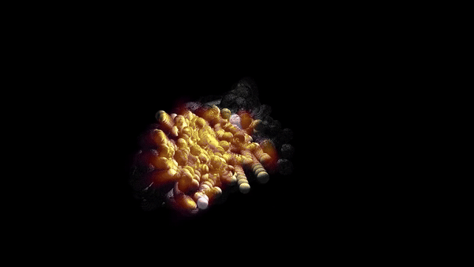

# Penguin Patterns

Penguin Patterns is a generative artwork that visualises the huddling movement of emperor penguins.
The work is made in TouchDesigner, and portrays the movement as if it were a 3D huddle instead of a 2D huddle. In collaboration with Zoë Breed. 

Paper is provided on request. 

